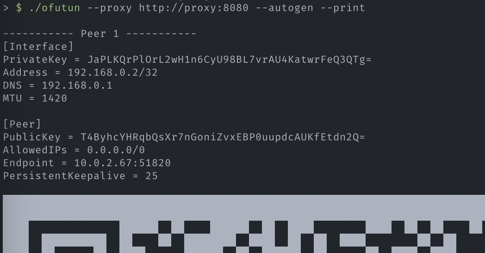

# ofutun

Convert HTTP/HTTPS proxy to **wireguard+transparent proxy**


On mobile devices, Proxy is available only when connected to Wi-Fi.  
With this tool, you can use proxies regardless of Wi-Fi/mobile connection.

## Feature

- http/https proxy conversion by SNI/Hosts header
- No Privilege Required
  - Everything works in user space.
  - (Built-in TCP/IP stack, powered by gvisor)

## Usage

```sh
> $ ofutun --help                                 
Usage:
  ofutun [OPTIONS]

Application Options:
      --proxy=            Proxy address to use for tunneling
  -a, --autogen           Automatically generate a private key and public key for the server
  -p, --print             Print the configuration for the peers
      --proxy-insecure    Ignore TLS certificate errors for the proxy
      --private-key=      Base64-encoded private key for the server
      --peer=             List of peer public keys and IP addresses in the format <public-key>,<ip>
      --priv-peer=        List of peer private keys and IP addresses in the format <private-key>,<ip>
      --local-ip=         Local IP address to assign to the tunnel interface (default: 192.168.0.1)
  -l, --listen-port=      Port to listen on for incoming connections (default: 51820)
      --dns-forwarder=    DNS servers to forward queries to (default: 8.8.8.8, 1.1.1.1)
      --http-ports=       List of HTTP ports to allow (default: 80)
      --https-ports=      List of HTTPS ports to allow (default: 443)
      --disable-non-http  Disable non-HTTP/HTTPS traffic

Help Options:
  -h, --help              Show this help message

> $ ofutun --proxy http://proxy:8080 --print --autogen
> $ # Docker Example
> $ docker run -it --rm --net=host ghcr.io/hrntknr/ofutun:main --proxy http://proxy:8080 --print --autogen
```


